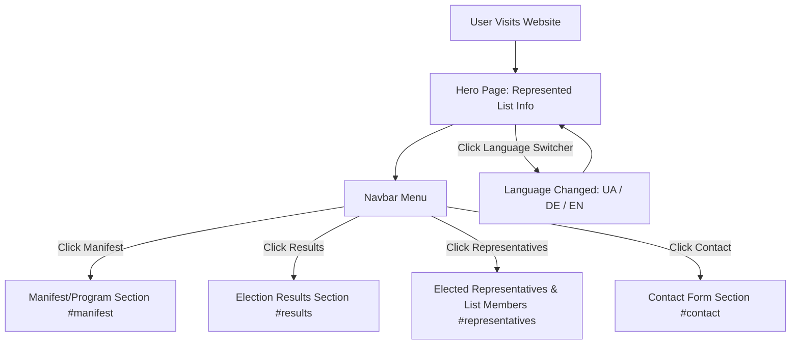
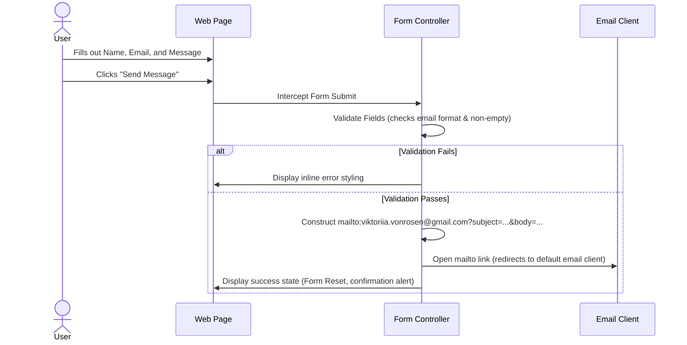

# User Flow - Ukrainian List Frankfurt (Council Representative Page)

This document maps out the user experience, layout sections, and interactions for the updated website of the Ukrainian List (UD) represented in the Frankfurt Foreigners Advisory Council (KAV).

## 1. Landing Page Navigation Flow

### 1.1 Language Switcher
- Location: Navbar (top right).
- Actions: Buttons for Ukrainian 🇺🇦, German 🇩🇪, and English 🇬🇧.
- Flow: Changes the active locale (`ua`, `de`, `en`) instantly, updates text labels, and saves preference in `localStorage`.

---

## 2. Interactive Sections & Layout

### 2.1 Hero Section
- **Visuals**: Static group header image, clear H1 typography, clean background.
- **Pivot**: Changed from campaign voting call to a representation message ("Ukrainian voice in Frankfurt's council").
- **Call-to-Action (CTA)**: Button targeting `#contact` ("Contact us" / "Зв'язатися з нами").

### 2.2 Manifest Section (`#manifest`)
- **Visuals**: Grid of priority cards (4 pillars).
- **Interaction**: Micro-animations on hover (card translates slightly upwards, box-shadow deepens).

### 2.3 Election Results Section (`#results`)
- **Visuals**: Clean card-based visual dashboard.
  - **Metrics**: 36,927 votes (4.2%) | 2 Seats.
  - **Status**: Official Final Results (Amtliches Endergebnis) of KAV Election 2026.
- **spotlight**: Highlights Viktoriia von Rosen and Sofiia Petroshenko as elected council members.

### 2.4 Representatives Section (`#representatives`)
- **Visuals**: Grid layout of candidates.
- **Pivot**: Highlighting the two elected representatives first, with special badges "Elected Representative" / "Обрана представниця" / "Gewählte Vertreterin".
- **Interaction**: Clicking any representative opens a modal detailing their background and role.

---

## 3. Contact Form Submission Flow

### 3.1 Form Validation Fields
- **Name**: Required.
- **Email**: Required. Must match regex `/^[^\s@]+@[^\s@]+\.[^\s@]+$/`.
- **Message**: Required. Minimum length 10 characters.
